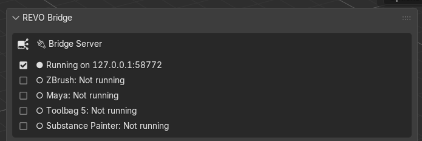
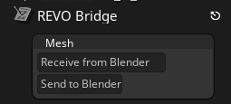
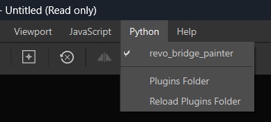
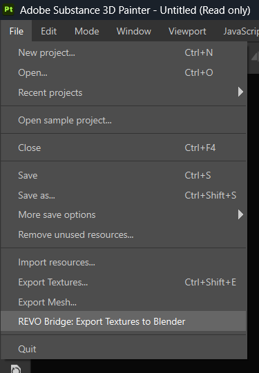

# First Use

Use a simple mesh (a UV-unwrapped cube is enough) to confirm each DCC you care about.

## Bridge Directions

Some directions auto-import; others need a button in that DCC.

| Send | Receive | Auto? | What you do |
| --- | --- | --- | --- |
| Blender → ZBrush | ZBrush | No | In ZBrush, click **Receive from Blender**. Receive overwrites the active SubTool |
| ZBrush → Blender | Blender | Yes | In ZBrush, click **Send to Blender**. Blender auto-imports if that option is on |
| Blender → Maya | Maya | Yes | **Export to Maya**. Maya auto-imports after the plugin is installed |
| Maya → Blender | Blender | Yes | In Maya, **Export to Blender**. Blender auto-imports if that option is on |
| Blender → Toolbag | Toolbag | Yes | **Export to Toolbag** or **Create Bake Project**. Blender **launches** Toolbag with the REVO Bridge plugin as a boot script, so the window opens and Toolbag imports |
| Toolbag → Blender | Blender | File yes, plugin no | In Toolbag open **Edit > Plugins > Revo_Bridge** and leave it open, then **Export Scene to Blender**. Blender auto-imports that file. Focusing Toolbag does not start the plugin |
| Blender ↔ Painter | Both | Yes | **Create Painter Project**, then Painter **File > REVO Bridge: Export Textures to Blender** |

## Before you start

- The bridge server is **Running** in the N-Panel.
- Executable paths are set under **Utilities**.
- Plugins were installed from **Integrations** and the DCC was restarted.

	

## ZBrush

1. Select one or more mesh objects in Blender.
2. Click **Export to ZBrush**.
3. In ZBrush, check the **active SubTool** — receive overwrites it.
4. Click **Receive from Blender** in the REVO Bridge palette.
5. Use **Send to Blender**, then **Import from ZBrush** in Blender (or wait for Blender auto-import).

	

## Maya

1. Select the mesh in Blender.
2. Click **Export to Maya**.
3. In Maya, use the **REVO_Bridge** shelf **Import from Blender** button if auto-import is off.
4. Select the character group, or its rig root and meshes, in Maya. Click the
   shelf's visible **FBX** or **USD** export button.
   Blender auto-imports it; use **Import from Maya** if auto-import is off.

FBX and USD carry portable hierarchy, skeleton, skinning, blend-shape, and animation
data. Maya-only controller logic and custom dependency-graph nodes do not have an
equivalent cross-DCC representation, so bake animation when needed.

	

## Toolbag 5

1. Select the mesh in Blender.
2. Click **Export to Toolbag**. Default format is USD (materials and textures).
3. If Toolbag was not already running, it opens **with the REVO Bridge window** and imports the mesh. That is the boot script, not a live hook into an existing Toolbag.
4. To send back: in Toolbag choose **Edit > Plugins > Revo_Bridge** if that window is not already open, leave it open, then **Export Scene to Blender**. Blender auto-imports.

If Toolbag was already open without the plugin window, Export to Toolbag still writes the file, but Toolbag will not auto-import until you run **Edit > Plugins > Revo_Bridge** and click **Import from Blender** there.

For baking, see [Toolbag Baker](../user-guide/baker.md). **Create Bake Project** also launches Toolbag with the plugin so the baker is built automatically. It always uses FBX, not USD.

	

## Painter

1. Select the mesh in Blender (materials should use Principled BSDF).
2. Click **Create Painter Project**.
3. Painter opens a new project, or the working copy of the `.spp` set under **Existing Project**.

For UDIMs, use **Split by UDIM (Legacy)** for one Texture Set per tile, or
**Use UV Tiles** for one Texture Set containing its tiles.

Use **Existing Project** to reuse a saved Painter setup, such as a different
shader or color-management settings.

When painting is complete, use Painter's **File > REVO Bridge: Export Textures
to Blender**. Blender applies the returned maps automatically when auto-import
is enabled; otherwise click **Import Textures from Painter**. The button can
also reapply the latest successful Painter export. When **Existing Project** is
set, REVO Bridge opens its working copy; saving in Painter overwrites that copy.

	

	

## If nothing happens

See [If send or receive stops](../user-guide/FAQ.md#if-send-or-receive-stops) in the FAQ.
