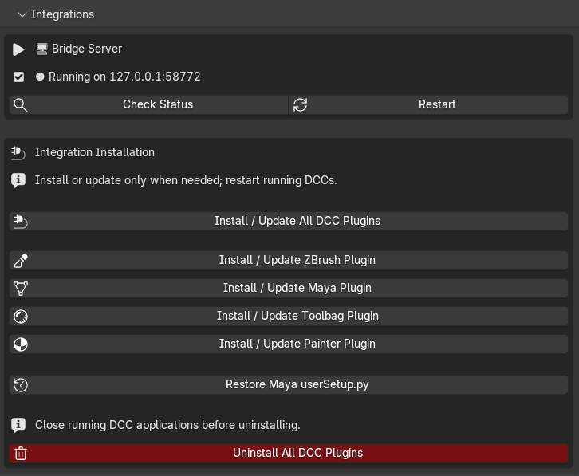

# Installation and Update

Supported and workflow-tested Blender versions: 4.2 through 5.2. Windows only.

## Install in Blender

The ZIP is a Blender Extension package. Do not extract it before installing.

### Drag-and-drop (Blender 4.2+)

1. Open Blender.
2. Drag `REVO_Bridge_Blender.zip` into the Blender window.
3. Confirm the install prompt.
4. Open the **REVO Bridge** tab in the 3D View N-Panel (`N`).

### Install from Disk

`Edit > Preferences > Get Extensions > Install from Disk`, then choose `REVO_Bridge_Blender.zip`.

If an older **REVO Sync** extension is still enabled, disable and remove it first. Blender treats `revo_bridge` as a new addon.

## After installation

1. Confirm the **REVO Bridge** tab appears in the 3D View N-Panel.
2. Confirm the bridge server shows as **Running** (Auto-Start is on by default).
3. Open **Utilities** and set each DCC executable path you use.
4. Open **Integrations** and choose **Install / Update All DCC Plugins**.
5. Restart ZBrush, Maya, Toolbag and Painter if they were already open.

{ .doc-shot }

Painter installs a Python helper plugin. Enable `revo_bridge_painter` from
Painter's **Python** menu after restarting it.

## DCC plugin locations

| DCC | What gets installed | Where to look after restart |
| --- | --- | --- |
| ZBrush | Compiled `REVO_Bridge.zsc` plus `REVO_BridgeData/sync_dir.txt` | **ZPlugin > REVO Bridge** and the REVO Bridge palette |
| Maya | Plugin, shelf, scripts, managed `userSetup.py` block | **REVO_Bridge** shelf; Plugin Manager: `REVO_Bridge.py` |
| Painter | Python plugin and transfer-folder configuration | Enable `revo_bridge_painter` in Painter's **Python** menu |
| Toolbag 5 | User plugin folder `Revo_Bridge/__main__.py` | REVO Bridge window when Toolbag starts from Blender |

ZBrush 2026 loads `.zsc` at startup. A `.txt` left in the plugin folder is **not** compiled automatically.

The Maya installer follows the version in the configured executable path. A Maya 2026 path installs into the Maya 2026 user folder even if Maya 2027 is also present.

## Update

1. Install the new `REVO_Bridge_Blender.zip` over the previous extension.
2. Run **Install / Update All DCC Plugins** once.
3. Restart ZBrush, Maya, Toolbag and Painter so they pick up the new helpers.

An update also replaces leftover REVO Sync plugin files.

REVO Bridge makes a timestamped backup before changing Maya `userSetup.py`. Use **Restore Maya userSetup.py** in Integrations if you need the previous file.

## Uninstall DCC plugins

Close ZBrush, Maya, Toolbag and Painter, then open **Integrations** and click
**Uninstall All DCC Plugins**. Confirm the prompt and restart the DCCs.

Each install or update records the exact REVO plugin destinations in a shared,
Blender-version-independent manifest. The uninstall action removes only those
recorded REVO files and the managed REVO block inside Maya `userSetup.py`. It
does not remove projects, general DCC preferences, safety backups, Blender
materials, or files in the transfer folder.

For integrations installed by an older REVO Bridge build, run **Install / Update
All DCC Plugins** once with the current version so their locations are recorded
before uninstalling.

## Verify installation

- Blender: N-Panel tab **REVO Bridge**, server **Running**.
- ZBrush: **ZPlugin > REVO Bridge** after restart.
- Maya: **REVO_Bridge** shelf after restart.
- Toolbag: Create Bake Project or Export to Toolbag launches Toolbag with a **REVO Bridge** window.
- Painter: Create / Update Painter Project launches Painter with the USD.
