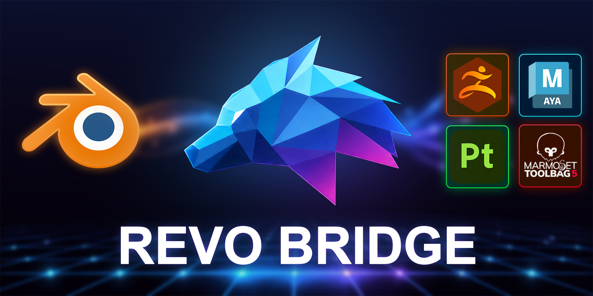

# REVO Bridge Documentation

REVO Bridge moves selected meshes between **Blender**, **ZBrush**, **Maya**, **Marmoset Toolbag 5** and **Substance 3D Painter**. It is a send/receive round-trip, not a live-link. It also creates a configured Toolbag Baker project from named high and low meshes.

Public version: **1.0.0**

Workflow-tested across Blender **4.2 through 5.2** with ZBrush 2026,
Marmoset Toolbag 5, Maya 2026/2027 character rigs, and Substance 3D Painter
project creation plus painted/baked material return.

Use the navigation on the left to get started.

---

## Start here

1. [Introduction](getting-started/introduction.md) — what it does and what it does not do
2. [Installation and Update](getting-started/installation-and-update.md) — Blender ZIP plus DCC plugins
3. [First Try](getting-started/first-try.md) — send a mesh and confirm each DCC

## User guide

- [User Interface](user-guide/user-interface.md)
- [ZBrush](user-guide/zbrush.md)
- [Maya](user-guide/maya.md)
- [Marmoset Toolbag 5](user-guide/toolbag.md)
- [Marmoset Toolbag 5 Baker](user-guide/baker.md)
- [Substance 3D Painter](user-guide/painter.md)
- [FAQ](user-guide/FAQ.md)
