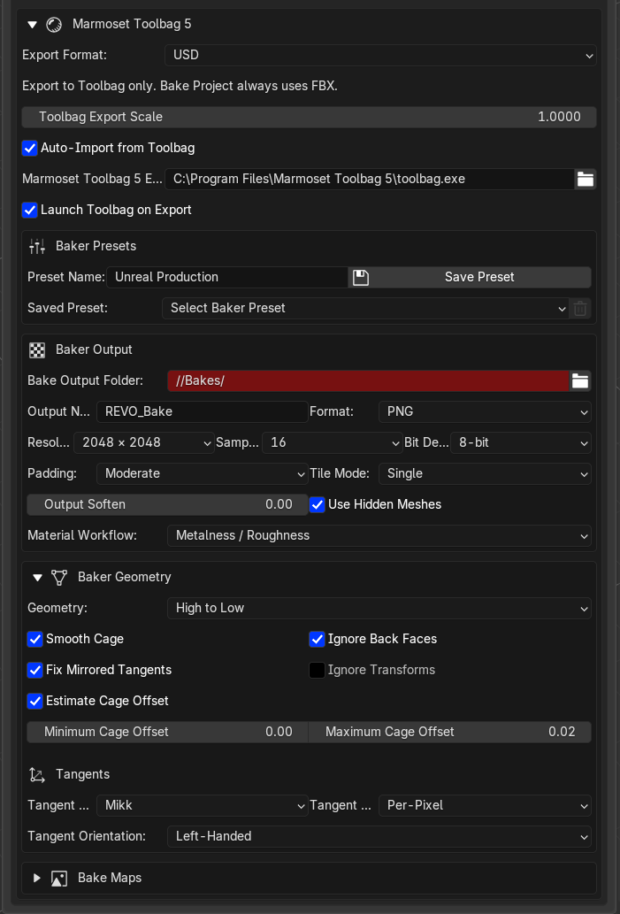
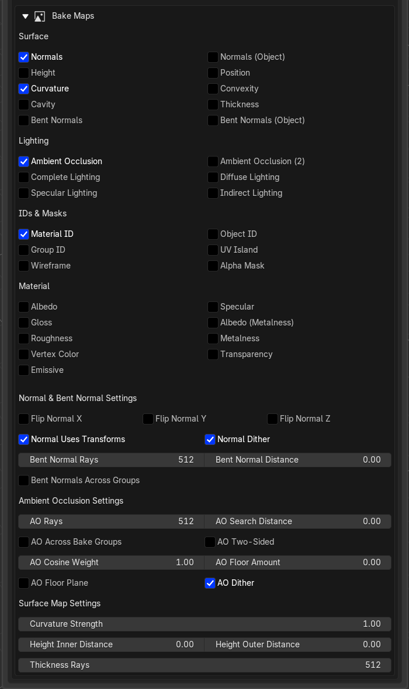

# Marmoset Toolbag 5 Baker

**Create Bake Project** validates the selected high/low meshes, exports them as FBX, and **launches Toolbag with the REVO plugin** so Toolbag imports the meshes and builds a configured native Baker. You bake and preview in Toolbag, not in Blender. If Toolbag is already open without that window, open **Edit > Plugins > Revo_Bridge** so it can read the bake request.

## Naming

Names follow Toolbag's Quick Loader convention:

```text
asset_low
asset_high
asset_high_01
```

The text before `_low` or `_high` is the bake group. When you select several
meshes and run **Name as Low** or **Name as High**, REVO names the first one
`asset_low` or `asset_high`, followed by numbered variations such as
`asset_high_01` and `asset_high_02`.

Custom variation names are also valid—for example, `asset_high_detail`—but the
naming dialog does not currently provide a variation field. To use a custom
suffix, rename the Blender object manually and give its mesh datablock the same
name, then run **Validate Names**. You can change the datablock name in **Object
Data Properties**. Matching object and datablock names allow Toolbag Quick
Loader to fill the correct High and Low slots.

## Setup

1. Select low meshes and choose **Name as Low**.
2. Select matching high meshes and choose **Name as High**.
3. Use the same group name for both sides.
4. Select **only** the high and low meshes that belong in the project.
5. **Validate Names** — checks naming, matching high/low groups, non-empty geometry and a UV map on every low mesh.
6. **Create Bake Project**.

If the blend file is unsaved, the default `//Bakes/` output folder uses the REVO Bridge transfer folder instead of a Windows UNC path.

!!! tip "Use Hidden Meshes"
    Toolbag Quick Loader hides the High group after import. **Use Hidden Meshes** is on by default so the high poly still takes part in the bake. If you turn it off, the baker can write blank maps even though High and Low look present in the outline.

## Format

Create Bake Project always exports as FBX, even when Export Format is set to USD. The USD option only applies to Export to Toolbag.

Compatible image textures are embedded automatically, so the high-poly material inputs are preserved for material and lighting bakes. Procedural Blender nodes are not supported directly and must be baked to image textures first.

## Settings you can send

Configured from Utilities → Marmoset Toolbag 5:

{ .doc-shot }

{ .doc-shot }

- Output folder, base name, PNG / TGA / PSD / TIFF / EXR
- Resolution 512–8192, samples 1–32, bit depth 8/16/32
- Padding, softening, tile mode (single / texture sets / UDIM)
- Geometry mode: high-to-low, low-to-low, UV match
- Cage range (Blender units, converted to Toolbag centimetres), estimate offset
- Tangents: Mikk (default), Marmoset, Maya, 3DS Max; left-handed default for Unreal / Painter
- All Toolbag 5 bake maps, with extra controls for normals, AO, curvature, height, thickness and bent normals
- AO uses Toolbag names: Ray Count, Search Distance, Cavity Weight, Floor Occlusion, Floor, Ignore Groups, Two-Sided
- Metalness/Roughness or Specular/Gloss material workflow
- Saved REVO baker presets

Default maps: Normals, Ambient Occlusion, Curvature, Material ID.

## After Toolbag opens

Baking and preview stay in Toolbag's Baker UI. Confirm:

- High and Low slots have meshes
- The maps you want are enabled
- **Use Hidden Meshes** is on if the High group is hidden
- Output path is writable

Then bake from Toolbag.

## Limits

Toolbag does not expose painted offset and skew maps through its Python API. REVO Bridge can set cage ranges and automatic offsets. Localized cage or skew corrections remain manual in Toolbag.
