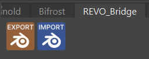
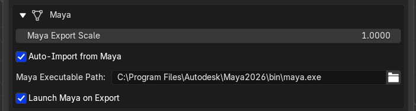

# Maya

The Maya installer follows the version in the configured executable path. A Maya 2026 executable installs into the Maya 2026 user folder, even when Maya 2027 is also installed.

{ .doc-shot }

## What the installer adds

- `REVO_Bridge.py` to `plug-ins`
- `revo_bridge_maya.py` and both shelf icons to `scripts`
- `shelf_REVO_Bridge.mel` to the shelf preferences
- A managed loader block to `userSetup.py`

REVO Bridge makes a timestamped backup before changing an existing file. Use **Restore Maya userSetup.py** in Integrations to restore the latest backup.

Restart Maya after installing. The **REVO_Bridge** shelf has separate visible
**FBX** and **USD** export buttons plus an import button.

## Workflow

1. Select the character meshes, armature, or enclosing hierarchy in Blender,
   choose **FBX** or **USD** under **Utilities > Maya > Transfer Format**, then choose
   **Export to Maya**.
2. Maya auto-imports after the plugin is installed (or use the shelf **Import from Blender** button).
3. Send a mesh back with **Export to Blender**. Blender auto-imports if that option is on.

### Maya to Blender: characters and rigs

Select the character's enclosing group, or select the rig root and skinned meshes,
then click the Maya shelf's **FBX** or **USD** export button.

- FBX includes the selected child hierarchy, joints, skinning, blend shapes,
  animation connections, and constraints supported by the FBX interchange.
- USD includes the selected hierarchy as well as UsdSkel skeletons, skinning,
  animation over Maya's playback range, blend shapes, and USD Preview Surface materials.

!!! warning "Interchange limits"
    FBX and USD preserve the portable character data, not Maya's complete native
    dependency graph. Maya-only controller logic, expressions, custom nodes, and
    some constraints cannot become equivalent Blender rig logic. Bake animation
    first when that logic drives motion that must arrive exactly.

## Settings (Utilities)

{ .doc-shot }

- Maya export scale (default `1.0`; FBX unit scale covers Blender metres to Maya centimetres in most cases)
- Transfer Format (FBX or USD) for Blender to Maya
- Auto-import from Maya
- Maya executable path
- Launch Maya on export
