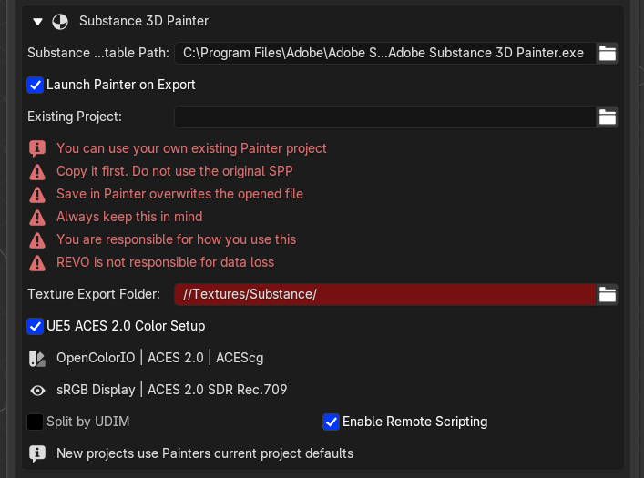

# Substance 3D Painter

Select one or more Blender meshes and click **Create / Update Painter Project**. REVO Bridge exports `substance_import.usd` with UVs, normals, material assignments and compatible USD material data, then launches Painter with that mesh. Each Blender material assignment becomes a Painter Texture Set.

Painter texture exchange is bidirectional. Blender keeps the original geometry;
the return trip updates its materials with Painter's exported texture maps.

Install the Painter helper from **Integrations**, restart Painter, and enable
`revo_bridge_painter` from Painter's **Python** menu. Use
**File > REVO Bridge: Export Textures to Blender** when the project is ready.
Blender auto-imports the result by default, or you can click
**Import Textures from Painter**.

The REVO export contains separate Base Color, Roughness, Metallic, combined
Normal, Height, Emission, Opacity and mixed AO maps. It supports UV tiles/UDIMs.
Painter always produces an OpenGL combined normal for Blender. This is also true
when the Painter project uses DirectX normals: Painter performs the conversion
during export, so Blender must not flip the green channel again.

Texture Set names do not have to remain identical to the original Blender
material names. REVO first looks for an existing matching material. If none is
found, it creates a Blender material named after the Painter Texture Set and
replaces the original material slot on the object that was sent to Painter.

For each returned Texture Set, Blender creates or updates a Principled BSDF
node setup. Base Color and Emission use sRGB; Roughness, Metallic, AO, Height,
Opacity and Normal use non-color data. AO is multiplied with Base Color, and
the OpenGL normal is connected through a Normal Map node. Height feeds a Bump
node when no combined normal was exported. Existing REVO-generated Painter
nodes are replaced on later sends so the material can be refreshed cleanly.

{ .doc-shot }

{ .doc-shot }

## Settings (Utilities)

{ .doc-shot }

- Painter executable path
- Launch Painter on export
- Existing `.spp` project (leave empty to create a new project)
- Texture export folder, passed to Painter as the default export location
- Split by UDIM (Painter's one-Texture-Set-per-tile mode)
- Auto-import textures from Painter
- Enable remote scripting at launch
- UE5 ACES 2.0 Color Setup

Leave **Existing Project** empty to create a new project. You can use your own existing Painter project, but **make a copy of it first**. Do not point **Existing Project** at the original. If you hit **Save** in Substance Painter, the opened file is overwritten. Always keep this in mind.

New projects with no `.spp` set use Painter's current File → New defaults, because the official command line does not expose template, resolution, normal format or color management. **Split by UDIM** is the legacy one-Texture-Set-per-tile CLI flag and does not switch on Painter's modern UV Tile workflow; put that in the starter `.spp` instead.

The plugin also copies the file you set into the **Texture Export Folder** on first export (the copy is the same size as the original, which can be several GB) and opens that working copy. That is an extra safety net, not a reason to skip making your own copy. Later exports reuse the working copy.

## Starter project (best practice)

Painter's New Project window is how you pick shader, document resolution, normal format, UV Tile mode and color management. REVO cannot set those on the command line, so the reliable way is a starter `.spp`.

1. In Painter, **File → New**, or open a project you already like.
2. If it is a project you care about, **duplicate it first**. Do not use the original.
3. A cube is enough if you are only storing settings. You will replace the mesh from Blender later.
4. Set shader, resolution, OpenGL vs DirectX, UV Tile, ACES 2.0, and the rest.
5. Save the copy somewhere you intend to work in, then point **Existing Project** at **that copy**.
6. **Create / Update Painter Project**. Work and **File → Save** only in the copy.

!!! warning "Do not use the original Painter project"
    You can use your own existing projects, but make a copy first. Do not use the original. **Save** in Substance Painter overwrites the opened file. Always keep this in mind.

    The plugin may also duplicate the `.spp` (a full copy, which can be many GB). **File → Save As** can still overwrite the original. You are responsible for how you use this.

!!! danger "Disclaimer"
    REVO Bridge is **not responsible** for lost Painter projects, overwritten files, or other data loss. You are responsible for how you use the plugin, including which `.spp` you point it at and when you save in Substance Painter. Keep your own backups.

## UE5 ACES 2.0 Color Setup

This is enabled by default for **new** projects only. REVO Bridge uses Painter's bundled ACES 2.0 OCIO configuration (ACEScg working space) and selects the sRGB display with the ACES 2.0 SDR Rec.709 view.

Requires Painter **11.0.3** or newer. Existing `.spp` projects keep their own color-management setup. Blender's `OCIO` environment is not passed through, so a starter saved as Painter ACES 2.0 is not replaced by Blender's Linear Rec.709 config.
