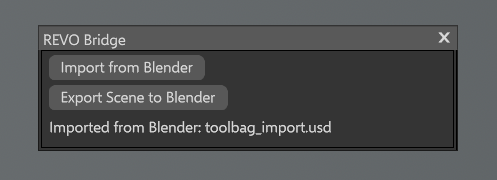

# Marmoset Toolbag 5

The Toolbag installer adds a REVO Bridge plugin to the Toolbag 5 user plugin folder. Refresh plugins or restart Toolbag after installing it.

{ .doc-shot }

## Send and receive

| Direction | What happens |
| --- | --- |
| **Export to Toolbag** or **Create Bake Project** | Blender writes the file and **launches** Toolbag with the REVO plugin as a boot script. The plugin window opens and Toolbag imports automatically |
| **Toolbag → Blender** | You must open **Edit > Plugins > Revo_Bridge** in Toolbag and leave that window open, then click **Export Scene to Blender**. Blender auto-imports the USD. Focusing Toolbag from Blender does not start the plugin |

That split is a Toolbag limit. A boot script only runs when Toolbag **starts**. If Toolbag is already running, nothing outside Toolbag can open a plugin for you. Opening the plugin once per session is expected.

## Export to Toolbag vs Bake Project

| Action | Format | Purpose |
| --- | --- | --- |
| **Export to Toolbag** | USD by default (FBX optional) | Send the scene with materials and textures |
| **Create Bake Project** | Always FBX | Toolbag Quick Loader grouping of `_low` / `_high` meshes |

**Export Format** in Utilities applies only to **Export to Toolbag**. It does not change Bake Project.

USD transfers selected meshes, UVs, normals, vertex colors, material assignments, USD Preview Surface materials and referenced textures. Use a Principled BSDF setup for the most reliable conversion. FBX is the compatibility option.

The Toolbag window only handles **Import from Blender** and **Export Scene to Blender**. Leave it open. **Export Scene to Blender** writes the same USD as Toolbag's **File > Export** dialog: meshes, materials, lights, skies, cameras, UVs and normals, with texture paths kept. Subdivision and displacement are not baked into the mesh. Toolbag's USD exporter does not include animation tracks. Baking stays in Toolbag's native Baker interface after **Create Bake Project**.

**Import from Toolbag** in Blender loads a USD Toolbag already wrote. It does not start the Toolbag plugin. If the REVO window is not open, open **Edit > Plugins > Revo_Bridge**, click **Export Scene to Blender**, then import (or wait for Blender auto-import).

Toolbag writes a binary USD crate (`.usdc`) into the transfer folder.

## Settings (Utilities)

{ .doc-shot }

- Export format (USD or FBX) — Export to Toolbag only
- Export scale
- Auto-import from Toolbag
- Toolbag executable path
- Launch Toolbag on export

Baker output, maps, geometry and presets are in the same Toolbag block. See [Toolbag Baker](baker.md).
