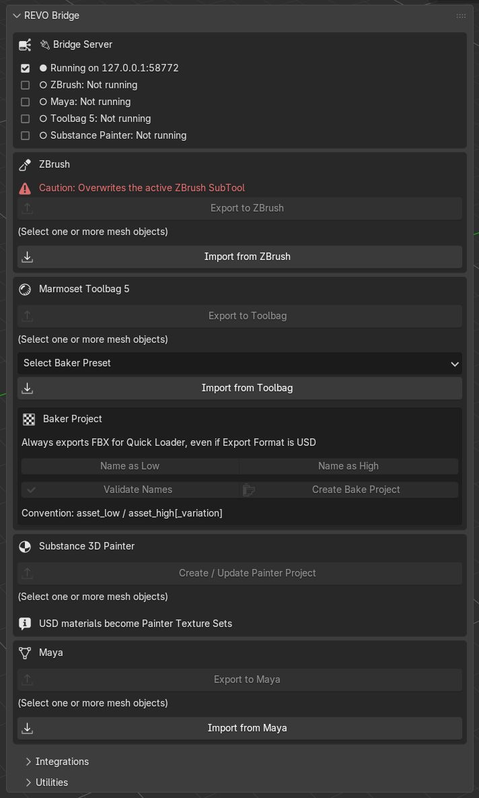
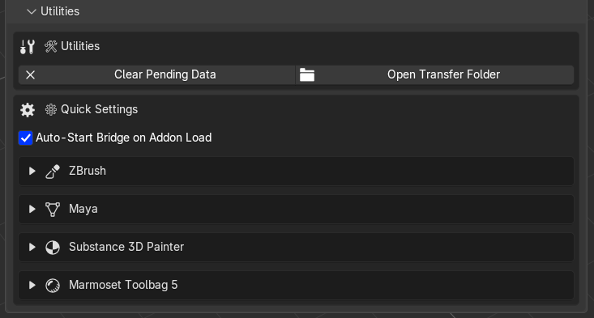

# User Interface

The **REVO Bridge** tab in the 3D View N-Panel has three sections.

{ .doc-shot }

## REVO Bridge (main)

Status first, then per-DCC export/import.

| Block | What it shows / does |
| --- | --- |
| Bridge Server | Running or stopped, plus which DCCs Blender can see |
| ZBrush | Export to ZBrush, Import from ZBrush. Warns that receive overwrites the active SubTool |
| Marmoset Toolbag 5 | Export to Toolbag (launches Toolbag with the plugin), Import from Toolbag (needs **Edit > Plugins > Revo_Bridge** already open), baker naming and **Create Bake Project** |
| Substance 3D Painter | Create / Update Painter Project, Import Textures from Painter |
| Maya | Export to Maya, Import from Maya |

A pending import shows a per-DCC **Clear … Pending** button. Use it when a stale file is blocking a new send.

**Create Bake Project** always exports FBX for Toolbag Quick Loader, even when **Export Format** is USD.

## Integrations

{ .doc-shot }

| Action | Purpose |
| --- | --- |
| Check Status | Refresh server / DCC detection |
| Restart | Restart the local bridge server |
| Install / Update All DCC Plugins | ZBrush, Maya, Toolbag and Painter in one step |
| Install / Update ZBrush / Maya / Toolbag / Painter | Individual installers |
| Restore Maya userSetup.py | Restore the newest backup made before REVO edited that file |

Install or update only when needed, then restart the running DCC.

## Utilities

{ .doc-shot }

Quick settings live here so you do not have to open Blender Preferences for every path.

- **Clear Pending Data** and **Open Transfer Folder**
- Per-DCC expandable blocks for ZBrush, Maya, Painter and Toolbag
- Painter existing-project caution (copy first, do not use the original) under Substance 3D Painter
- Toolbag baker output, maps, geometry, tangents and presets

The local server **port** and a custom transfer parent folder are in `Edit > Preferences > Add-ons > REVO Bridge`. A custom folder still uses a `REVO_Bridge` subfolder inside it.

Default transfer folder: `%TEMP%\REVO_Bridge`.
