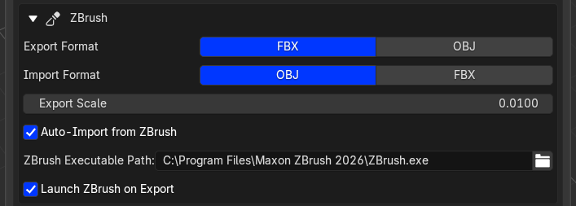

# ZBrush

{ .doc-shot }

Select one or more mesh objects in Blender and choose **Export to ZBrush**. In ZBrush, click **Receive from Blender** in the REVO Bridge palette. ZBrush does not auto-import from Blender.

!!! warning "Active SubTool is overwritten"
    ZBrush imports into the **active SubTool**. Check which SubTool is active before receiving a Blender export.

Use **Send to Blender** in ZBrush, then **Import from ZBrush** in Blender. **Auto-Import from ZBrush** in Blender can do that last step.

## Settings (Utilities)

{ .doc-shot }

- Export Format and Import Format dropdowns (FBX or OBJ; OBJ is the usual import format)
- Export scale (default `0.01`; import applies the inverse)
- Auto-import from ZBrush
- ZBrush executable path
- Launch ZBrush on export

## Plugin install

The installer copies the compiled `REVO_Bridge.zsc` into a writable ZBrush startup plugin folder (`ZStartup/ZPlugs64`) and writes `REVO_BridgeData/sync_dir.txt` with the local transfer folder path.

ZBrush 2026 loads `.zsc` files at startup. It does **not** compile a `.txt` left in that folder. Restart ZBrush after installing or updating.

Buttons are under **ZPlugin > REVO Bridge** and the **REVO Bridge** palette.
